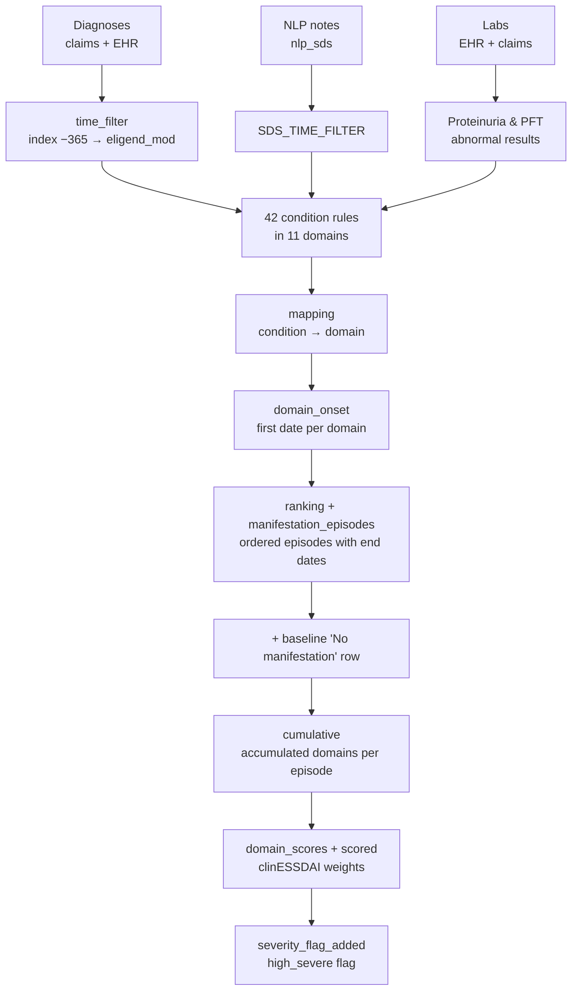
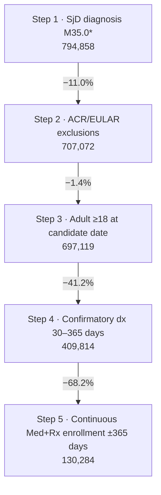

# SjD Systemic Manifestations, Disease-Severity Scoring, and Follow-Up Episodes
 
**Data source:** Optum Market Clarity — Sjögren's / Graves' Disease Cohort
**Schema:** `market_clarity_graves_disease_202605_v1_20260622_prod`
**SQL dialect:** Trino / Presto (e.g., AWS Athena)
**Study:** Manifestation 2026 HEOR study (merged version)
 
This README covers two connected queries:
 
| Part | Query | Output grain | Output |
|---|---|---|---|
| A | Manifestation episodes & severity | One row per patient × manifestation episode | `severity_flag_added` (stored as `manifestation_final_updated`) |
| B | Clipped follow-up episodes | One row per patient × episode active on or after the index date | `followup_final` |
 
The third block in the pasted file, headed "complete code", repeats the first half of Part A and stops partway through, after the `mapping` CTE. Its header comments are kept here as the change log (Section 11).
 
---
 
## 1. Purpose
 
**Part A** identifies when each patient first develops systemic Sjögren's disease (SjD) involvement in each of **11 organ domains**. The domains follow the EULAR ESSDAI framework:
- Constitutional
- Lymphadenopathy
- Glandular
- Articular
- Cutaneous
- Pulmonary
- Renal
- Muscular
- Peripheral nervous system (PNS)
- Central nervous system (CNS)
- Hematological
Evidence comes from diagnosis codes (claims and EHR), EHR clinical-note NLP, and lab results. Part A then:
1. Orders the domains by onset date to build a timeline of **accumulating manifestations** ("episodes").
2. Scores each episode with **clinESSDAI domain weights** applied to domain presence.
3. Flags episodes that meet the study's **high-severity** definition.
**Part B** restricts those episodes to the **follow-up period**, from the index date to the end of continuous enrollment. Episodes already in progress at the index date are started at the index date. Part B also records the patient's pre-index manifestation state and when severity began.
 
---
 
## 2. Data Sources
 
### 2.1 Source tables (Optum Market Clarity)
 
| Table | Data type | Fields used |
|---|---|---|
| `argenx_graves_202605_clm_med_diag` | Medical claim diagnoses | `ptid`, `diag`, `fst_dt` |
| `argenx_graves_202605_diag` | EHR diagnoses | `ptid`, `diagnosis_cd`, `diag_date` |
| `argenx_graves_202605_nlp_sds` | EHR NLP — signs, diseases, symptoms from clinical notes | `ptid`, `note_date`, `sds_term`, `sds_sentiment` |
| `argenx_graves_202605_lab` | EHR lab results | `ptid`, `loinc`, `test_result`, `normal_range`, `result_unit`, `order_date`, `collected_date`, `result_date` |
| `argenx_graves_202605_clm_lab` | Claims-linked lab results | `ptid`, `loinc_cd`, `rslt_nbr`, `low_nrml`, `hi_nrml`, `rslt_unit_nm`, `fst_dt` |
 
The schema name indicates a **May 2026 data cut (`202605`), version 1, built 22 June 2026**. *(Inferred from the naming convention — confirm with the data engineering team.)*
 
### 2.2 Upstream dependencies
 
| Object | Used by | Role | Required columns |
|---|---|---|---|
| `final_cohort_2026_updated` | A, B | Final SjD study cohort | `ptid`, `date_of_first_diagnosis` (index date), `eligend_mod` (end of continuous enrollment, capped) |
| `manifestation_final_updated` | B | Stored output of Part A (`severity_flag_added`) | All Part A output columns |
 
---
 
## 3. Observation Window
 
All diagnosis, NLP, and lab evidence is restricted to **index − 365 days through `eligend_mod`**. This covers the one-year baseline and the whole follow-up period. Part A can therefore date manifestations that began before the index date. Part B then separates out the follow-up portion.
 
---
 
## 4. Part A — Processing Logic
 

 
---
 
## 5. Condition Definitions by Domain
 
Codes are ICD-10-CM, upper-cased, with dots removed. **Qualification rules:**
- **1+** — at least one occurrence in the window.
- **2+ dates** — at least two distinct dates.
- **±30d gate** — the anchor code must have a supporting code within 30 days before or after it.
The onset date (`inf`) is the first qualifying date.
 
| Domain | Condition label | Evidence | Rule |
|---|---|---|---|
| **Constitutional** | `CON_FEVER` | Fever: R50.81, R50.9 | 2+ dates |
| | `CON_WL` | Weight loss / cachexia: R63.4, R64 | 2+ dates |
| | `CON_NS` | Night sweats: R61 **or** NLP term `night sweats` (with negated or uncertain sentiments excluded) | 2+ dates (codes and notes combined) |
| **Lymphadenopathy** | `LYM_LYM` | Enlarged lymph nodes: R59.0, R59.1, R59.9 | 1+ |
| | `LYM_spl` | Splenomegaly: R16.1, R16.2 | 1+ |
| | `LYM_MBI` | Malignant B-cell proliferation: follicular lymphoma (C82), non-follicular lymphoma (C83.0/.1/.3/.7), other NHL (C85.1/.2/.8/.9), MALT lymphoma (C88.40), mature B-cell leukemias (C91.1/.3/.4/.A, not-in-remission and relapse codes) | 1+ |
| **Articular** | `Art_arthralgia` | Arthralgia (M25.50, M25.53x, M25.54x, M25.57x, M25.59, M79.64x, M79.67x), qualifying through **any one** of three gates or a direct code (see below) | Gate or direct code |
| | `art_synovitis` | Synovitis/tenosynovitis: M65.8x, M65.9x, M70.03x, M70.04x | 1+ |
| **Glandular** | `GLAND_PAROTID` | Salivary gland hypertrophy, sialoadenitis, abscess: K11.1, K11.20–K11.22, K11.3; plus L51.0 *(see Section 12, item 6)* | 1+ |
| | `GLAND_SUBMAND` | Localized swelling of head/neck: R22.0, R22.1 | 1+ |
| | `GLAND_LACH` | Dacryoadenitis / lacrimal enlargement: H04.01, H04.02, H04.03x; dacryops H04.11x | 1+ |
| **Cutaneous** | `cut_ryth` | Erythema multiforme: L51.8, L51.9 | 1+ |
| | `cut_VASCULITIS` | Vasculitis limited to skin: L95.8, L95.9 | 1+ |
| | `cut_LUPUS` | Subacute cutaneous lupus: L93.1 | 1+ |
| | `cut_PURPURA` | Other nonthrombocytopenic purpura: D69.2 | 1+ |
| **Pulmonary** | `PULM_COUGH` | Cough (R05.1–R05.9) **gated by** bronchiectasis/bronchiolitis (J47.0, J47.1, J47.9, J84.115) | ±30d gate |
| | `PULM_ILD` | Interstitial lung disease (J84.09, J84.10, J84.11x, J84.17x, J84.2, J84.89, J84.9) **gated by** dyspnea (R06.00, R06.03, R06.09) | ±30d gate |
| | `PULM_TEST_ABNRML` | Pulmonary function test result flagged **Low** (below the lower limit of normal), from 28 LOINC codes in EHR or claims labs | 1+ |
| **Renal** | `REN_GLOMERULARINVOLVEMENT` | Glomerular disease (N00–N06 subtypes .0/.5–.9/.A, N06.1, N08, N25.89) **gated by** proteinuria: R80.8, R80.9, **or** a urine protein lab flagged High (6 LOINC codes) | ±30d gate |
| | `REN_MEMBRANOUS` | Membranous glomerulonephritis ("extra-membranous"): N0x.2 and subcodes | 1+ |
| | `REN_GLOMERULARONEPHRITIS` | Proliferative glomerulonephritis: N0x.3, N0x.4, N0x.B1/B2 | 1+ |
| | `REN_INFILTRATE` | Tubulo-interstitial nephritis: N11.8, N11.9, N12 | 1+ |
| | `REN_LEUKOCYTURIA` | R82.91 *(see Section 12, item 6)* | 1+ |
| | `REN_cRYOGLOBULINEMIA` | Cryoglobulinemia: D89.1 | 1+ |
| **Muscular** | `MSC_MYOSITIS` | Dermatomyositis/polymyositis (M33.1x, M33.2x, M33.9x), interstitial myositis (M60.1x), other/unspecified myositis (M60.8x, M60.9) | 1+ |
| **PNS** | `PN_mono` | Mononeuritis multiplex: G58.7 | 1+ |
| | `PN_trigeminal` | Trigeminal neuralgia: G50.0 | 1+ |
| | `PNS_CIDP` | CIDP (G61.81) **gated by** muscle weakness (M62.81) | ±30d gate |
| | `PN_ataxia` | Ataxia: G11.1x, G11.2, G11.3, G11.5, G11.6 | 1+ |
| | `PN_puresensory` | Pure sensory polyneuropathy: G60.8, G60.9, G62.89, G62.9 | 1+ |
| | `PN_motosensory` | Neuropathy (G60.3, G61.1, G61.8x, G61.9, G62.8, G63, G64, G90.09, G99.0) **gated by** muscle weakness (M62.81) | ±30d gate |
| | `PN_CRANIAL_NERVE` | Facial/cranial nerve disorders: G50.1/.8/.9, G51.x, G53 | 1+ |
| **CNS** | `cN_cranial` | Other cranial nerve disorders: G52.0–G52.3, G52.7–G52.9 | 1+ |
| | `cN_opticNeuritis` | Optic neuritis: H46.0x, H46.1x, H46.8, H46.9 | 1+ |
| | `cN_ms` | Multiple sclerosis: G35 and subtypes | 1+ |
| | `cN_vasculitis` | Cerebral arteritis (I67.7) **gated by** stroke codes (I63.x, I64, G46.x) | ±30d gate |
| | `cN_meningitis` | A87.2 | 1+ |
| | `cN_seizures` | Seizures: F44.5, G40.x epilepsy codes | 1+ |
| | `cN_TM` | Transverse myelitis: G37.3 | 1+ |
| **Hematological** | `hema_anemia` | Anemia: D63.8, D64.89, D64.9 | 1+ |
| | `hema_thrombo` | Thrombocytopenia: D69.3, D69.59, D69.6 | 1+ |
| | `hema_lympho` (lymphopenia) | D72.810 | 1+ |
| | `hema_lympho` (neutropenia) | D70.8, D70.9 | 1+ |
 
**Articular arthralgia gates.** An arthralgia code qualifies if any one of the following is true:
- an SjD diagnosis (`M350%`) is within ±30 days;
- an NLP mention of `morning stiffness` (with negated or uncertain sentiments excluded) is within ±30 days;
- an ICD-coded joint stiffness (M25.63x, M25.64x, M25.67x) is within ±30 days.
Separately, **M35.05** (Sjögren syndrome with inflammatory arthritis) qualifies on its own.
 
**NLP sentiment handling.** NLP mentions count when `sds_sentiment` is null or is not on an exclusion list. The list removes negated, denied, uncertain, risk, and "concern" contexts (e.g., `deny`, `negative`, `have.not`, `rule out`, `uncertain`). Night sweats and morning stiffness each have their own exclusion list.
 
**Lab flags.** EHR numeric results are compared with the normal range, which is parsed from `normal_range` as "low–high". Claims lab results are compared with `low_nrml` and `hi_nrml`. Each result is flagged:
- **Low** if below the low limit;
- **High** if above the high limit;
- **Normal** if within range;
- **'-'** if both limits are 0.
Results that cannot be parsed get no flag.
 
**Condition-to-domain mapping.** Each condition is assigned to a domain by the prefix of its label: `CON`, `LYM`, `ART`, `GLAND`, `CUT`, `PULM`, `REN`, `MSC`, `PN`, `CN`, `HEM`.
 
---
 
## 6. Part A — Episode Construction
 
**EP-01 — Domain onset.** For each patient and domain, the onset date is the earliest onset date among that domain's conditions.
 
**EP-02 — Ordering.** Domains are ranked by onset date (`rnk_or_manifestatn_accumulated` = 1, 2, 3…). When two domains start on the same date, their order is arbitrary.
 
**EP-03 — Episode end.** Each episode ends at the next domain's onset date. The patient's last episode ends at `eligend_mod`. Because domains accumulate, an episode is the period during which the patient has a given *set* of manifestations; its label is the newest domain added.
 
**EP-04 — Baseline row.** Every cohort patient gets a rank-0 row labelled **"No manifestation"**. It runs from index − 365 to the first manifestation date, or to `eligend_mod` if the patient never develops a manifestation.
 
**EP-05 — Duration.** `days_on_manifestation_X` is the number of days from the episode start to the episode end.
 
**EP-06 — Accumulation.** For each episode, `acquired` is the list of all domains reached up to and including that episode. The 11 domain flags (1/0), `n_manifestations_accumulated`, and `manifestations_accumulated` (e.g., "Glandular + Articular + Hematological") are all derived from this list.
 
---
 
## 7. Part A — Scoring and Severity
 
### 7.1 Domain weights
 
Each domain present in the accumulated set scores its full weight. The weights are the **clinESSDAI** weights, the clinical ESSDAI variant without the biological domain (Seror et al., 2016).
 
| Domain | Weight | Score column |
|---|---|---|
| Constitutional | 4 | `constitutional_score` |
| Lymphadenopathy | 4 | `lymphadenopathy_score` |
| Glandular | 2 | `glandular_score` |
| Articular | 3 | `articular_score` |
| Cutaneous | 3 | `cutaneous_score` |
| Pulmonary | 6 | `pulmonary_score` |
| Renal | 6 | `renal_score` |
| Muscular | 7 | `muscular_score` |
| PNS | 5 | `pns_score` |
| CNS | 5 | `cns_score` |
| Hematological | 2 | `hematological_score` |
 
`cumulative_score` is the sum of the 11 domain scores, with a maximum of 47.
 
In the published index, each domain's score is its weight multiplied by an activity level from 0 to 3. Activity level cannot be measured from claims or EHR codes, so this script uses a level of 1 for every domain that is present. The result is a **presence-based, clinESSDAI-weighted** score. It is not the published clinESSDAI total and should not be compared with published activity thresholds.
 
### 7.2 Severity flags
 
| Flag | Definition |
|---|---|
| `individual_score_severe` | 1 if the accumulated set includes Pulmonary, Renal, or Muscular |
| `severity_conditions` | 1 if the patient has **ever** had any of: splenomegaly, malignant B-cell proliferation, synovitis, subacute cutaneous lupus, cutaneous vasculitis, purpura, CIDP, mononeuritis multiplex, or motor-sensory neuropathy |
| `high_severe` | 1 if **any** of these is true: `individual_score_severe = 1`, `cumulative_score ≥ 6`, CNS present, or `severity_conditions = 1` |
 
Pulmonary (6), Renal (6), and Muscular (7) each reach the score threshold on their own. In practice, `high_severe` therefore reduces to: cumulative score ≥ 6, **or** CNS involvement, **or** any listed severity condition.
 
---
 
## 8. Part B — Clipped Follow-Up Episodes
 
**FU-01 — Episodes kept.** Part B starts from the Part A output. It keeps episodes that are **still active after the index date** (end date > index) or that **start on or after the index date**.
 
**FU-02 — Clipping.** An episode that started before the index date and is still active at index is restarted at the index date (`manifestation_start_date`). Its original start date is kept as `manifestation_start_date_original`, and `started_pre_index = 1`.
 
**FU-03 — Re-ranking.** Follow-up episodes are renumbered from 0 in date order. The original rank is kept as `rnk_original`.
 
**FU-04 — Duration.** Duration is recalculated from the clipped start date.
 
**FU-05 — Pre-index state.** The accumulated manifestations and the count from the episode spanning the index date are carried onto every follow-up row as `pre_index_manifestations` and `n_pre_index_manifestations`. If no episode spans the index date, the values are "No manifestation" and 0.
 
**FU-06 — Domain flags and scores.** These are carried over unchanged from Part A. They are cumulative, so they include pre-index domains.
 
**FU-07 — Severity dating.**
- `first_high_severe_date` is the earliest episode start date (original, not clipped, and excluding the baseline row) where `high_severe = 1`.
- `ever_high_severe` is 1 if that date exists.
- `high_severe_from_date` is 1 on rows starting on or after it.
- `severe_before_index` is 1 if severity began before the index date.
---
 
## 9. Output Specification
 
### 9.1 Part A (`severity_flag_added` / `manifestation_final_updated`)
 
| Column | Description |
|---|---|
| `ptid` | Patient ID |
| `manifestation_label` | Domain added in this episode, or "No manifestation" |
| `manifestation_start_date` | Episode start |
| `rnk_or_manifestatn_accumulated` | Episode order (0 = baseline row) |
| `Current_manifestation_end_date_or_elig_end` | Episode end (next onset or `eligend_mod`) |
| `days_on_manifestation_X` | Episode duration in days |
| `Constitutional` … `Hematological` (11 columns) | Cumulative 0/1 domain flags |
| `n_manifestations_accumulated` | Number of domains accumulated |
| `manifestations_accumulated` | Domain list joined with " + " |
| `<domain>_score` (11 columns) | Weighted domain scores |
| `individual_score_severe`, `cumulative_score`, `severity_conditions`, `high_severe` | Severity components and the final flag |
 
### 9.2 Part B (`followup_final`)
 
This contains all the Part A columns listed above, plus the following:
 
| Column | Description |
|---|---|
| `index_date`, `eligend_mod` | Follow-up start and end |
| `manifestation_start_date_original` | Start date before clipping |
| `rnk_original` | Part A rank |
| `started_pre_index` | 1 if the episode began before the index date |
| `pre_index_manifestations`, `n_pre_index_manifestations` | Accumulated state at the index date |
| `first_high_severe_date`, `ever_high_severe`, `high_severe_from_date`, `severe_before_index` | Severity timing |
 
---
 
## 10. How to Run
 
1. Confirm that `final_cohort_2026_updated` contains `date_of_first_diagnosis` and `eligend_mod`.
2. Run Part A. Save the output as `manifestation_final_updated`, for example with `CREATE TABLE manifestation_final_updated AS …`.
3. Run Part B.
Do not use the truncated "complete code" block; it stops after the `mapping` CTE.
 
---
 
## 11. Change Log (from the merged-version header)
 
| # | Change |
|---|---|
| 1 | `DX_Gi` (glomerular involvement) now holds only the plain glomerular-disease codes. The membranous and proliferative codes are counted separately in `renal_mg` and `renal_gln`. |
| 2 | Proteinuria now comes from lab results flagged High **as well as** ICD codes R80.8/R80.9. |
| 3 | The renal lab CTEs have a `_renal` suffix to separate them from the pulmonary lab CTEs (`_pulm`). |
 
The code also marks four rules as **"NOT IN NEW LIST"**, meaning they are kept in the code but are not in the latest specification:
- M35.05 counted as arthralgia;
- the bronchiectasis gate for cough;
- the muscle-weakness gate for CIDP and motor-sensory neuropathy;
- the stroke gate for cerebral vasculitis.
---
 
## 12. Assumptions, Limitations, and Points for Review
 
Items marked **Action** should be resolved before results are shared.
 
**1. Severity conditions are not dated, so severity can appear too early.** `severity_conditions` is set per patient, not per episode. If a patient ever has a listed condition (e.g., purpura), `high_severe = 1` on **every** row, including the baseline row and episodes before the condition occurred. Part B's `first_high_severe_date` is then the patient's first episode, which may be earlier than the true onset of severity. Part A already contains correctly dated logic (`severity_condition_onset` → `severity_date_calc` → `severity_final`), but it is not used: the final `SELECT` returns `severity_flag_added`. **Action:** output `severity_final` (with `severity_date`), or make `severity_conditions` depend on each condition's own onset date.
 
**2. The pre-index state is lost when a domain starts on the index date.** If a new domain begins exactly on the index date, which is common because manifestations are often coded at the diagnosis visit, the earlier episode ends on the index date. That episode fails the "end > index" test, and no row has `started_pre_index = 1`. `pre_index_manifestations` is then reported as "No manifestation", even though the cumulative flags show earlier domains. **Action:** use `end >= index` for the spanning row, or take the last episode starting before index.
 
**3. The CNS vasculitis gate rarely matches.**
- Most of the stroke codes are category headers rather than billable codes; only I63.6 and I63.9 are billable.
- `I64` is not an ICD-10-CM code.
- `G460A`–`G468A` are not valid ICD-10-CM codes.
Cerebral vasculitis will therefore rarely qualify. **Action:** expand the gate to the billable I63.x subcodes.
 
**4. Other header codes will not match billable data.**
- `H0401` and `H0402` (lacrimal) need a laterality digit.
- `G618` and `G628` (neuropathy) and `G513` (cranial nerve) are headers.
The billable subcodes are covered for some of these but not all. **Action:** check each list against billable ICD-10-CM codes.
 
**5. A single low PFT result makes a patient high-severe.** `PULM_TEST_ABNRML` needs only one result below the normal range, with no supporting diagnosis. It adds the Pulmonary domain (weight 6), which by itself triggers `high_severe`. PFT results are often reported as % predicted, with normal ranges missing or inconsistent. **Action:** consider requiring a confirmatory diagnosis or a minimum number of results, and review the 28 PFT LOINC codes.
 
**6. Some codes do not match their labels.**
- **L51.0** (nonbullous erythema multiforme) is in the parotid-swelling list. The code comment already flags this.
- **R82.91** is used for leukocyturia, but pyuria is coded **R82.81** in ICD-10-CM.
- **A87.2** is lymphocytic *choriomeningitis*, a viral infection, not SjD-related aseptic lymphocytic meningitis.
- **F44.5** is conversion disorder with seizures (non-epileptic) and is included in CNS seizures.
- **G11.x** is hereditary ataxia, which is unlikely to reflect SjD sensory ganglionopathy.
- **G60.8/G60.9** (hereditary and idiopathic neuropathies) are used for pure sensory polyneuropathy.
- **R22.0/R22.1** (localized swelling of head/neck) are non-specific proxies for submandibular swelling.
- **D89.1** (cryoglobulinemia) is counted as renal involvement with or without kidney disease.
- The comment on `cutaneous_vasculitis` mentions M25.50, which is out of date.
**Action:** clinical review of each item.
 
**7. SjD organ-specific codes are not used.** Apart from M35.05, the organ-involvement SjD codes are not used. Examples include M35.02 (lung), M35.03 (myopathy), M35.04 (tubulo-interstitial nephropathy), and M35.06 (peripheral nervous system). **Action:** consider adding them to their domains.
 
**8. The arthralgia gate is weak.** One way to qualify is arthralgia plus any SjD diagnosis within ±30 days. Cohort patients have frequent SjD diagnoses, so most SjD patients with an arthralgia code will qualify.
 
**9. Neutropenia uses the lymphopenia label.** `HEMATO_NEUTROPENIA` is labelled `hema_lympho`, the same label as lymphopenia. The domain result is unaffected, but the two conditions cannot be told apart.
 
**10. Data types in the NLP union.** `PN_NS` returns `note_date` without casting it to a date, while `DX_NIGHT_SWEATS` returns a `DATE`. The `UNION` may fail or compare mismatched types. NLP term matching is also case-sensitive (`'night sweats'`, `'morning stiffness'`).
 
**11. Inconsistent EHR lab dates.** The EHR lab window filter uses order → collected → result date, but the test date is taken as collected → result → order. Text-only urine protein results (e.g., "1+", "Trace") are not captured.
 
**12. Same-day onsets get arbitrary order.** Domains with the same onset date are ranked arbitrarily, so the earlier one gets a 0-day episode. Counts are unaffected, but sequence analyses will be.
 
**13. No biological domain.** Hypergammaglobulinemia, low complement, and similar markers are not included. This is consistent with clinESSDAI.
 
**14. Unused CTEs in Part A.** `severity_condition_onset`, `episode_triggers`, `severity_date_calc`, `severity_final`, `pre_final_result`, `final_severe_dates`, and `attached` are calculated but not returned (see item 1).
 
---
 
## 13. Suggested Quality Checks
 
1. Count patients per condition and per domain. Check them against published SjD extra-glandular manifestation rates.
2. Confirm every patient has exactly one baseline row and that each patient's episodes are continuous and do not overlap.
3. Compare `high_severe` onset from `severity_flag_added` with `severity_date` from `severity_final` to measure the effect of Section 12, item 1.
4. Count patients with a domain onset exactly on the index date (Section 12, item 2).
5. Look at the share of Pulmonary-domain patients who qualified **only** through an abnormal PFT result.
6. Check the most common `sds_sentiment` values for the two NLP terms to confirm the exclusion lists.
---
 
## 14. Glossary
 
| Term | Definition |
|---|---|
| SjD | Sjögren's disease; ICD-10-CM `M35.0x` |
| ESSDAI | EULAR Sjögren's Syndrome Disease Activity Index: 12 domains, weighted by activity level |
| clinESSDAI | Clinical ESSDAI: 11 domains without the biological domain, with re-estimated weights |
| Manifestation / domain | Organ system with systemic SjD involvement |
| Episode | Period between successive domain onsets, during which the accumulated set of domains is constant |
| SDS | Optum EHR NLP extraction of signs, diseases, and symptoms from clinical notes |
| `eligend_mod` | End of continuous enrollment, capped at death and data cutoff |
| PFT | Pulmonary function test |
 
---
 
## 15. Document Control
 
| Field | Value |
|---|---|
| Owner | *TBD* |
| Reviewer | *TBD* |
| Data cut | May 2026 (`202605`), v1, built 2026-06-22 |
| Last updated | *TBD* |
 
— 130,284 patient funnel

# SjD Patient Funnel 2026 — Cohort Selection (130,284 Patients)
 
**Data source:** Optum Market Clarity — Sjögren's / Graves' Disease Cohort
**Schema:** `market_clarity_graves_disease_202605_v1_20260622_prod`
**SQL dialect:** Trino / Presto (e.g., AWS Athena)
**Output grain:** One row per patient (`ptid`)
**Final cohort size:** **130,284 patients**
 
---
 
## 1. Purpose
 
This query builds the **final Sjögren's disease (SjD) study cohort** for the 2026 HEOR analyses. A patient enters the cohort when all of the following hold:
 
1. They have a recorded SjD diagnosis.
2. They have none of the ACR/EULAR exclusion conditions.
3. They are an adult at the diagnosis date.
4. The diagnosis is **confirmed by a second SjD diagnosis 30–365 days later**.
5. They have continuous medical and pharmacy enrollment for one year before and one year after the index date.
The **index date** (`date_of_first_diagnosis`) is the earliest diagnosis date that meets all of these rules.
 
The output feeds the downstream analyses. These include baseline characteristics and CCI, systemic manifestations and severity, treatment patterns, HCRU, and cost.
 
---
 
## 2. Patient Funnel
 
| Step | Criterion | Patients | Change from previous step | Code step |
|---|---|---|---|---|
| 1 | **SjD diagnosis:** at least one SjD code (ICD-10-CM `M35.0*`) recorded between Oct 2021 and Mar 2025 | **794,858** | — | `filter0_sjd` |
| 2 | **ACR/EULAR exclusions:** removal of patients with prespecified SjD exclusion conditions (Jan 2015 – Mar 2026) | **707,072** | −87,786 (−11.0%) | `filter1_sjd` |
| 3 | **Adult:** aged 18 or older at the candidate SjD diagnosis date | **697,119** | −9,953 (−1.4%) | `age_all_dates` |
| 4 | **Confirmatory diagnosis:** at least one more SjD diagnosis 30–365 days after the candidate diagnosis | **409,814** | −287,305 (−41.2%) | `sjd_pairs` |
| 5 | **Continuous enrollment:** medical + pharmacy coverage for 365 days before index and at least 365 days after index (variable follow-up) | **130,284** | −279,530 (−68.2%) | `qualified_index_dates` → `index_define` |
 
**Overall:** 16.4% of patients with an SjD diagnosis (130,284 of 794,858) form the final population.
 
*The counts come from the project funnel slide. The slide shows the adult step as "1%"; the drop is 1.4%. The screenshot cuts off below step 5, so any later step is not covered here.*
 

 
---
 
## 3. Data Sources
 
### 3.1 Source tables (Optum Market Clarity)
 
| Table | Data type | Fields used |
|---|---|---|
| `argenx_graves_202605_clm_med_diag` | Medical claim diagnoses | `ptid`, `diag`, `fst_dt` |
| `argenx_graves_202605_diag` | EHR diagnoses | `ptid`, `diagnosis_cd`, `diag_date` |
| `argenx_graves_202605_pt` | Patient demographics and mortality | `ptid`, `birth_yr`, `deceased_indicator`, `date_of_death` |
| `argenx_graves_202605_clm_con_enrl` | Continuous enrollment spans | `ptid`, `eligeff`, `eligend`, `coverage_ind` |
 
The schema name indicates a **May 2026 data cut (`202605`), version 1, built 22 June 2026**. *(Inferred from the naming convention — confirm with the data engineering team.)*
 
### 3.2 Upstream and downstream objects
 
| Object | Direction | Role |
|---|---|---|
| `excluded_patients_2026` | Input | Patients with ACR/EULAR exclusion conditions (IgG4-related disease, GVHD, sarcoidosis, amyloidosis, HIV, hepatitis C, head and neck cancer as a stand-in for radiation), Jan 2015 – Mar 2026. Built by a separate script. |
| `final_cohort_2026` | Input to the final `SELECT` / output of `index_define` | The cohort with `ptid` and `date_of_first_diagnosis`. |
| `final_cohort_2026_updated` *(likely)* | Output | The final `SELECT` adds `eligeff` and `eligend_mod`. The manifestation/severity script reads these columns from `final_cohort_2026_updated`. |
 
---
 
## 4. Processing Logic
 
| CTE | What it does |
|---|---|
| `filter0_sjd` | Collects SjD diagnoses (`M350%`) from claims and EHR between 2021-10-01 and 2026-03-31. |
| `deceased_patients` | Finds patients flagged as deceased who have no date of death. |
| `deceased_with_post_death_activity` | Finds SjD patients with any diagnosis recorded after the end of their death month. |
| `filter1_sjd` | Removes the ACR/EULAR-excluded patients and the two death-quality groups. |
| `sjd_dates` | Lists the distinct SjD diagnosis dates for each patient. |
| `age_all_dates` | Calculates age at every diagnosis date and keeps only the dates where the patient was an adult. |
| `sjd_pairs` | Pairs each adult diagnosis date with any later SjD diagnosis 30–365 days after it. |
| `death_info`, `enroll_spans` | Pull Med+Rx enrollment spans. Each span's end date is capped at the death date and at 2026-03-31. |
| `enrollment_flag` | Checks each diagnosis date for continuous enrollment from 365 days before to 365 days after. |
| `qualified_index_dates` | Keeps the earlier date of each pair, provided it is also continuously enrolled. |
| `index_define` | Takes the earliest qualifying date per patient as `date_of_first_diagnosis`. |
| Final `SELECT` | Reads `final_cohort_2026` and adds the enrollment span (`eligeff`, `eligend_mod`) that contains the index date. |
 
---
 
## 5. Business Rules
 
**BR-01 — SjD diagnosis codes.** Codes are upper-cased, trimmed, and stripped of dots. Any code starting with `M350` qualifies, which covers ICD-10-CM M35.0 and all its subcodes. Both claims (`fst_dt`) and EHR (`diag_date`) diagnoses count.
 
**BR-02 — Diagnosis window.** The code collects diagnoses from 2021-10-01 to **2026-03-31**. The slide describes step 1 as Oct 2021 – **Mar 2025**; see Section 8, item 2.
 
**BR-03 — ACR/EULAR exclusions.** Patients in `excluded_patients_2026` are removed.
 
**BR-04 — Deceased with no death date.** Patients with `deceased_indicator = '1'` and no recorded `date_of_death` are removed, because their follow-up cannot be measured.
 
**BR-05 — Activity after death.** A patient who is flagged as deceased or has a death date is removed if they have any medical-claim or EHR diagnosis dated after the **last day of the death month**. Death dates are stored as year and month only (`YYYYMM`). Patients whose death date cannot be parsed are not removed.
 
**BR-06 — Birth year.** The top-coded values `'1937 and Earlier'` and `'1936 and Earlier'` become 1937 and 1936. `'Unknown'` and any other non-numeric value become null.
 
**BR-07 — Adult at candidate date.** Age is calculated as the year of the diagnosis minus the birth year. Only dates where the patient is 18 or older remain as candidates. Patients with an unknown birth year are dropped.
 
**BR-08 — Confirmatory diagnosis.** A candidate date is confirmed when the same patient has another adult SjD diagnosis **30 to 365 days later** (inclusive). The confirming diagnosis can fall up to 2026-03-31.
 
**BR-09 — Enrollment spans.** Only `coverage_ind = 'Med+Rx'` spans are used. Each span ends at the earliest of three dates: the recorded `eligend`, the death date (first day of the death month), and 2026-03-31.
 
**BR-10 — Continuous enrollment.** A candidate date qualifies when **one single span** starts on or before candidate − 365 days and ends on or after candidate + 365 days. Follow-up can run longer than one year, up to `eligend_mod`.
 
**BR-11 — Index date.** The index date is the **earliest** candidate date that is adult, confirmed, and continuously enrolled.
 
**BR-12 — Effective index window.** Enrollment is capped at 2026-03-31 and must last 365 days after the index date. So in practice, every index date falls between **2021-10-01 and about 2025-03-31**. This matches the slide's window, even though the code collects diagnoses to 2026.
 
**BR-13 — Enrollment attached to the output.** The final output adds the enrollment span that contains the index date. Its `eligend_mod` marks the end of each patient's follow-up.
 
---
 
## 6. Output Specification
 
| Column | Description |
|---|---|
| `ptid` | Optum de-identified patient ID |
| `date_of_first_diagnosis` | Index date |
| *(any other columns stored in `final_cohort_2026`)* | Carried through unchanged |
| `eligeff` | Start of the Med+Rx enrollment span containing the index date |
| `eligend_mod` | End of that span, capped at death and 2026-03-31; this is the end of follow-up |
 
---
 
## 7. How to Reproduce the Funnel Counts
 
Run `SELECT COUNT(DISTINCT ptid)` against each CTE:
 
| Step | Count from |
|---|---|
| 1 | `filter0_sjd` (filtered to `event_date <= DATE '2025-03-31'` to match the slide) |
| 2 | `filter1_sjd` |
| 3 | `age_all_dates` |
| 4 | `sjd_pairs` |
| 5 | `index_define` |
 
To store the cohort, end the CTE chain with `CREATE TABLE final_cohort_2026 AS SELECT * FROM index_define`. Then run the final `SELECT` to add the enrollment span.
 
---
 
## 8. Assumptions, Limitations, and Points for Review
 
Items marked **Action** should be resolved before results are shared.
 
**1. The query will not run as written.**
- The first line begins with an em dash (`—-`), so it is not read as a SQL comment.
- The final `SELECT` reads the stored table `final_cohort_2026`, not the `index_define` CTE above it. On its own the statement only adds enrollment to an existing table, and does not rebuild the cohort.
**Action:** fix the header line, and document the step that creates `final_cohort_2026` from `index_define`.
 
**2. The step 1 window differs between the code and the slide.** `filter0_sjd` collects diagnoses to **2026-03-31**, but the slide's step 1 says Oct 2021 – **Mar 2025**. The final cohort is not affected (see BR-12), but the step 1 count depends on the window used. **Action:** confirm which window produced 794,858 and use the same one in both the code and the slide.
 
**3. Death-quality exclusions are not shown on the funnel.** BR-04 and BR-05 remove patients at the same point as the ACR/EULAR exclusions. Step 2's −11% therefore includes both. **Action:** show the death-quality removals as their own step, or note them in step 2.
 
**4. `NOT IN` and null IDs.** If `excluded_patients_2026` or either death list contains a null `ptid`, the `NOT IN` filters return no rows at all. **Action:** use `NOT EXISTS`, or filter out null IDs.
 
**5. A single span must cover the full ±365 days.** Two back-to-back spans with no gap, such as after a plan change, fail the check. This is not an issue if `clm_con_enrl` already merges adjacent spans. **Action:** confirm how the table builds its spans.
 
**6. The output can duplicate patients.** The final `SELECT` left-joins any span containing the index date. Overlapping or duplicated spans would create more than one row per patient. The join also compares the raw `ptid` with a trimmed, upper-cased `ptid`. **Action:** confirm there is one row per patient (expected 130,284 rows).
 
**7. Two death-date conventions.** The post-death check uses the **last** day of the death month, while the enrollment cap uses the **first** day. A patient who dies during their 365th day of follow-up could fail enrollment by a few days.
 
**8. Age is approximate.** Age is calculated from calendar years only, so a patient who is 17 on the diagnosis date can be counted as 18.
 
**9. This is a prevalent cohort.** There is no washout period. Patients first diagnosed before October 2021 can enter with a later index date.
 
**10. All EHR diagnosis statuses count.** "History of" or "possible" SjD diagnoses in the EHR count as both candidate and confirming diagnoses.
 
**11. This algorithm differs from the T01 V6 funnel.** The T01 V6 funnel (`T01_PAT_FUNNEL_V6`) confirmed a diagnosis with a second diagnosis **at least 7 days** later **or** a positive anti-SSA/SSB lab. It also required enrollment through the confirmation date. This funnel requires a second diagnosis **30–365 days** later and does not use labs. The two cohorts will differ.
 
**12. `excluded_patients_2026` is not documented in this script.** If it was built with the same code lists as the V6 funnel, the ICD-9 hepatitis C codes may be missing their leading zero (e.g., `7051` instead of `07051`). See `README_SjD_Funnel_V6.md`, Section 9. **Action:** check the exclusion-list build.
 
---
 
## 9. Suggested Quality Checks
 
1. Reproduce each funnel count (Section 7) and compare it with the slide.
2. Confirm the final table has 130,284 distinct patients and one row per `ptid`.
3. Plot the distribution of `date_of_first_diagnosis` by quarter. No index date should fall after 2025-03-31.
4. Check that `eligend_mod` is at least index + 365 days for every patient.
5. Look at the distribution of the gap between the candidate and confirming diagnoses.
---
 
## 10. Glossary
 
| Term | Definition |
|---|---|
| SjD | Sjögren's disease (ICD-10-CM `M35.0x`) |
| ACR/EULAR | American College of Rheumatology / European League Against Rheumatism 2016 classification criteria |
| Candidate date | Any adult SjD diagnosis date that could become the index date |
| Confirmatory diagnosis | A second SjD diagnosis 30–365 days after the candidate date |
| Med+Rx | Enrollment that covers both medical and pharmacy benefits |
| `eligend_mod` | End of enrollment, capped at death and the data cutoff |
 
---
 
## 11. Document Control
 
| Field | Value |
|---|---|
| Owner | *TBD* |
| Reviewer | *TBD* |
| Data cut | May 2026 (`202605`), v1, built 2026-06-22 |
| Final cohort | 130,284 patients |
| Last updated | *TBD* |
